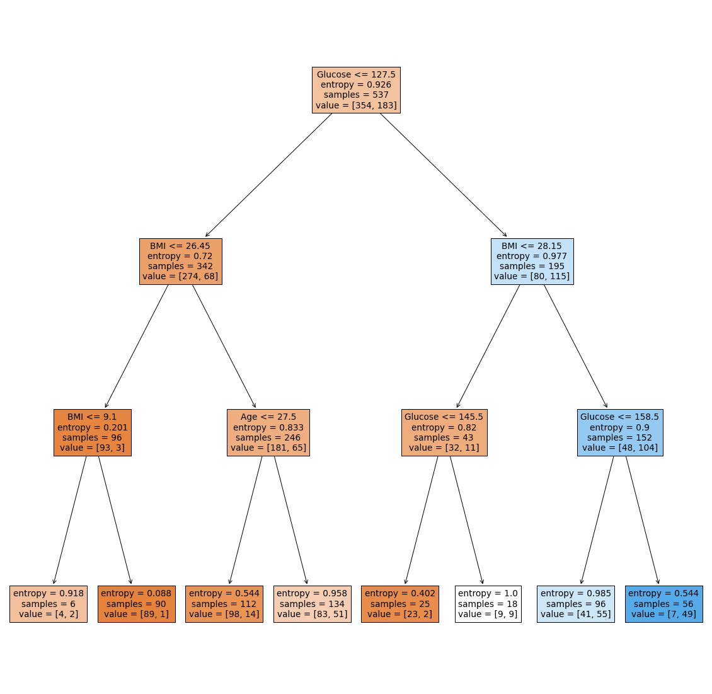

# Predict diabetes of patients from a dataset using Python
Model that Predicts diabetes of patients from a dataset using Python, check the above Notebook for more information.

## Problem Statement:

In this Notebook we build a Machine Learning model that accurately predicts whether or not patients in the dataset have diabetes or not based on the patient's Pregnancies, Glucose, Blood pressure, skin thickness, insulin, BMI, DiabetesPedigreeFunction and age.

## Approach:

The approach that we will take when building this model is that we will use the DecisionTreeClassifier, here we will choose the entropy criterion and then use the max depth of 3, we'll use the train/test split function to split our data into training and testing data here we let the test size to be 0.3 and the random state to be 1, we visualize the tree by using GraphViz which is needed in order to render the graphs into any of the plethora of output formats supported and we also use the PyDotPlus which is an improved version of the old pydot project that provides a Python Interface to Graphviz’s Dot language.

## What are Decision Trees?

Decision Trees (DTs) are a non-parametric supervised learning method used for classification and regression. The goal is to create a model that predicts the value of a target variable by learning simple decision rules inferred from the data features. A tree can be seen as a piecewise constant approximation.

The goal of using a Decision Tree is to create a training model that can be used to predict the class or value of the target variable by learning simple decision rules inferred from prior data(training data).

In Decision Trees, for predicting a class label for a record we start from the root of the tree. We compare the values of the root attribute with the record’s attribute. On the basis of comparison, we follow the branch corresponding to that value and jump to the next node.

Decision trees are built by splitting the training set into distinct nodes, where one
node contains all of, or most of, one category of the data.Training a machine learning model using a decision tree classification algorithm is about finding the decision tree boundaries.

## Prediction Accuracy Score:

Decison Tree's accuracy score: 77.05627705627705%

## Visualization:

